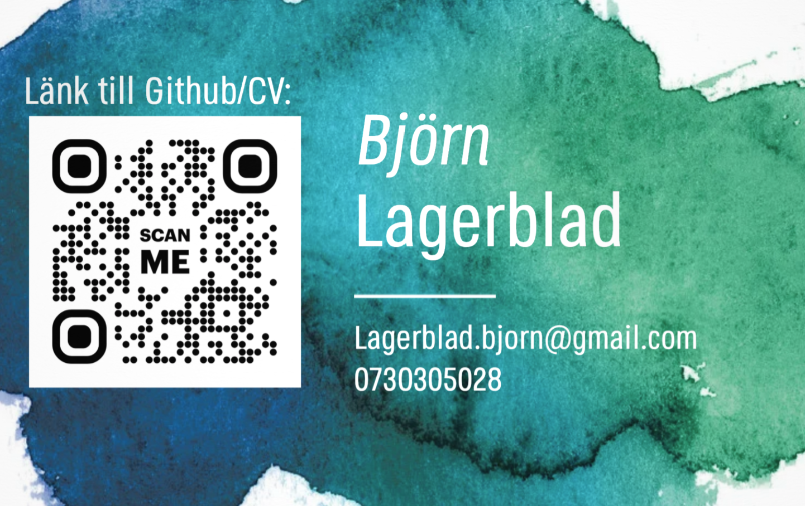

<h2 id="back-to-top">

# Hi there, I'm Björn 👋

* [Go to Projects](#projects-wip-section)

* [Go to CV](#CV)

* [Go to Contact me](#contact-me)

---
## 🧑‍💼 About me:

I am currently studying OOP programming with a focus on AI and Data Science at NBI Handelsakademin. With experience in customer-facing roles, I’ve developed strong problem-solving and communication skills.

Now, I’m eager to apply my knowledge in Python, SQL, and C# to build effective solutions and grow as a programmer.

---

## 🧑‍💻 Technical skills:

<table>
  <tr>
    <td>Data scientist</td>
    <td>Data analyst</td>
    <td>Business intelligence</td>
    <td>Machine learning</td>
  </tr>
  <tr>
    <td>Matplotlib</td>
    <td>Deep learning</td>
    <td>Computer vision</td>
    <td>Manim</td>
  </tr>
  <tr>
     <td>DuckDB</td>
    <td>Streamlit</td>
  </tr>
</table>

---
## 🔭 Roles I'm looking for:

| **Development Roles**   | **Data Science Roles**     | **Specialized Roles**          |
|-------------------------|----------------------------|--------------------------------|
| Developer               | Data Scientist             | AI Developer                   |
| Python Developer        | Machine Learning Engineer   | Data Visualization Specialist   |
| Full Stack Developer    | Data Engineer              | Research Scientist              |
|                         | Business Analyst           | DevOps Engineer                 |
|                         | Quantitative Analyst       | Software Engineer               |

---

### 🌱 Eager to Learn:
As a junior developer, I am excited about the journey ahead and eager to expand my knowledge in meaningful ways:

- **Building Strong Foundations**: I am committed to mastering the core principles of programming and data science, setting a solid base for my future growth.

- **Hands-On Learning**: I thrive on practical experience and am looking for opportunities to collaborate on projects where I can apply my skills and learn from others.

- **Exploring New Technologies**: I’m enthusiastic about diving into emerging tools and techniques that can enhance my ability to solve problems and create impactful solutions.

I believe that every challenge is a stepping stone to becoming a better developer, and I can’t wait to contribute my passion and energy to a dynamic team!

---

<h2 id="projects-wip-section">💼 Projects: OBS! UNDER CONSTRUCTION !OBS</h2>

Click on the links to view the corresponding GitHub repositories.

| Repository | Description |
| --- | --- |
| [Fullstack][fullstack] | Full-stack app with Streamlit and database integration |
| [Manim][manim] | Manim animations, working with Bézier curves and design | 
| [Data Science][data-science] | Exploratory data analysis and machine learning projects |
| [Matplotlib][matplotlib] | Data visualization projects using Matplotlib |
| [Pandas][pandas] | Pandas data manipulation projects |

[manim]: https://github.com/Markofbear/ManimTraining
[fullstack]: https://bjornyoutubedata.streamlit.app/
[pandas]: #link
[data-science]: #link
[matplotlib]: #link

---
<h2 id="CV">📓 CV</h2>

---

<h2 id="contact-me">🤝 Connect with me</h2>

- [: LinkedIn][linkedin]

[linkedin]: https://www.linkedin.com/in/bjorn-lagerblad

* [Back to top](#back-to-top)