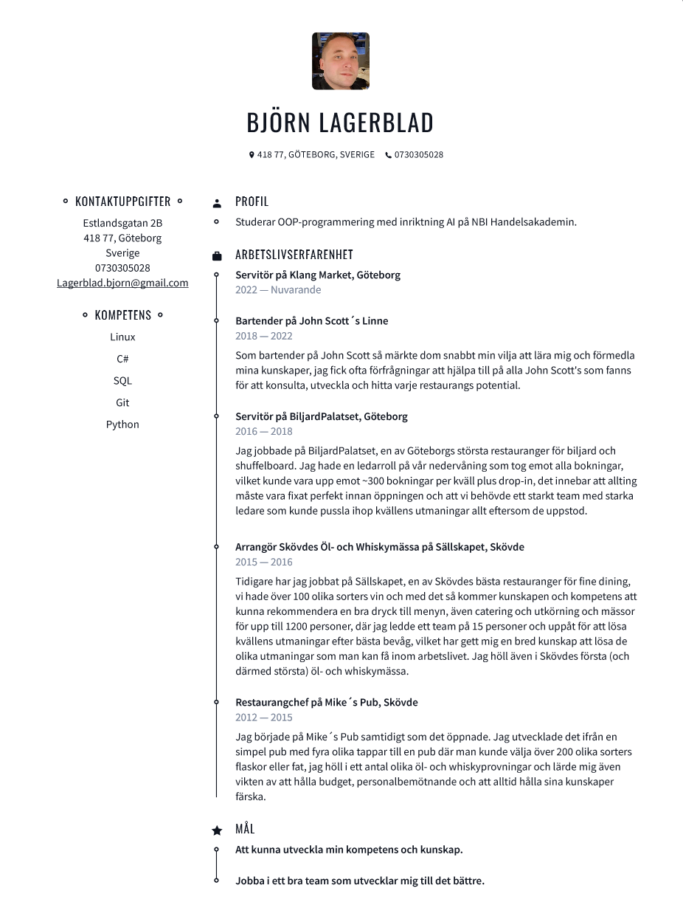

# Portfolio Björn Lagerblad
---
## About me:

I am currently studying OOP programming with a focus on AI at NBI Handelsakademin. With experience in customer-facing roles, I’ve developed strong problem-solving and communication skills.

Now, I’m eager to apply my knowledge in C#, Python, and SQL to build effective solutions and grow as a programmer.

---
## Passion Projects: WIP SECTION

---

---

# CV

---

## contact me

- [: LinkedIn][linkedin]

[linkedin]: https://www.linkedin.com/in/bj%C3%B6rn-lagerblad-81890858/

---