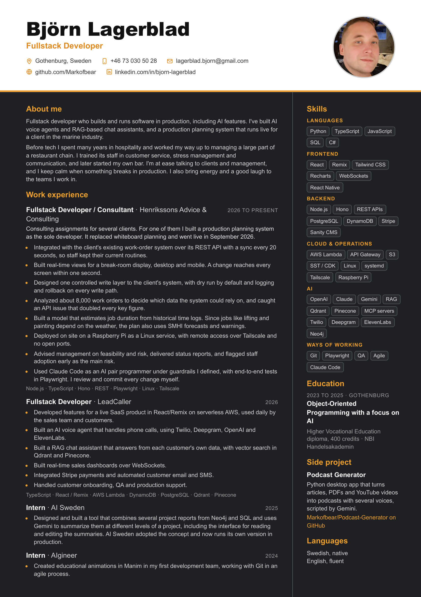
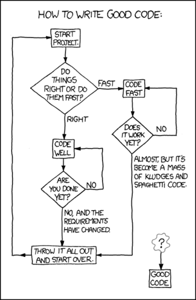

# Hi there, I'm Björn 👋

&nbsp;&nbsp;

📧 [lagerblad.bjorn@gmail.com](mailto:lagerblad.bjorn@gmail.com) · 📱 +46 73 030 50 28 · 📍 Gothenburg, Sweden

**[About](#about-me) · [Experience](#experience) · [Skills](#skills) · [Resume](#Resume) · [Contact](#contact-me)**

<h2 id="about-me">🧑‍💼 About me</h2>

Fullstack developer who builds and runs software in production, including AI features. I've built AI voice agents and RAG-based chat assistants, and a production planning system that runs live for a client in the marine industry.

Before tech I spent many years in hospitality and worked my way up to managing a large part of a restaurant chain. I trained its staff in customer service, stress management and communication, and later started my own bar. I'm at ease talking to clients and management, and I keep calm when something breaks in production. I also bring energy and a good laugh to the teams I work in.

<h2 id="experience">⭐ Experience</h2>

### Fullstack Developer / Consultant, Henrikssons Advice & Consulting AB · 2026 to present

Consulting assignments for several clients. For one of them I built a production planning system as the sole developer. It replaced whiteboard planning and went live in September 2026.

- Integrated with the client's existing work-order system over its REST API with a sync every 20 seconds, so staff kept their current routines.
- Built real-time views for a break-room display, desktop and mobile. A change reaches every screen within one second.
- Designed one controlled write layer to the client's system, with dry run by default and logging and rollback on every write path.
- Analyzed about 8,000 work orders to decide which data the system could rely on, and caught an API issue that doubled every key figure.
- Built a model that estimates job duration from historical time logs. Since jobs like lifting and painting depend on the weather, the plan also uses SMHI forecasts and warnings.
- Deployed on site on a Raspberry Pi as a Linux service, with remote access over Tailscale and no open ports.
- Advised management on feasibility and risk, delivered status reports, and flagged staff adoption early as the main risk.
- Used Claude Code as an AI pair programmer under guardrails I defined, with end-to-end tests in Playwright. I review and commit every change myself.

Stack: Node.js · TypeScript · Hono · REST · Playwright · Linux · Tailscale.

### Fullstack Developer, LeadCaller · 2026

- Developed features for a live SaaS product in React/Remix on serverless AWS, used daily by the sales team and customers.
- Built an AI voice agent that handles phone calls, using Twilio, Deepgram, OpenAI and ElevenLabs.
- Built a RAG chat assistant that answers from each customer's own data, with vector search in Qdrant and Pinecone.
- Built real-time sales dashboards over WebSockets.
- Integrated Stripe payments and automated customer email and SMS.
- Handled customer onboarding, QA and production support.

Stack: TypeScript · React / Remix · AWS Lambda · DynamoDB · PostgreSQL · Qdrant · Pinecone.

### Intern, AI Sweden · 2025

- Designed and built a tool that combines several project reports from Neo4j and SQL and uses Gemini to summarize them at different levels of a project, including the interface for reading and editing the summaries. AI Sweden adopted the concept and now runs its own version in production.

### Intern, AIgineer · 2024

- Created educational animations in Manim in my first development team, working with Git in an agile process.

[↑ Back to top](#back-to-top)

<!-- Projects section hidden for now. Remove this comment wrapper to show it again.

<h2 id="projects">💼 Projects</h2>

### 🎙️ Podcast Generator

> Turns a Wikipedia article, PDF, YouTube video or text file into a podcast with several AI voices.

A desktop app in Python and PySide6. It extracts the text from a source, has Gemini write a dialogue between several speakers, and lets you edit the script before it's voiced. You can pick OpenAI, ElevenLabs or Google for the voices, and it mixes in background music. The heavy work runs on background threads so the GUI stays responsive.

[▶ Watch the demo](https://www.linkedin.com/posts/bjorn-lagerblad_opentowork-opentowork-python-activity-7328735576239603713-BCtP) · [View code](https://github.com/Markofbear/Podcast-Generator)

**More projects**

| Project | What it is | |
| --- | --- | --- |
| [YouTube Data App][fullstack] | Streamlit app that analyzes YouTube data stored in a database | [🔗 Live][fullstack] |
| [Degree project][thesis] | File-sorting automation tool in Python, with a written thesis | [Code][thesis] |
| [Manim Animations][manim] | Teaching animations of Bézier curves, made in Manim | [Code][manim] |

[manim]: https://github.com/Markofbear/ManimTraining
[fullstack]: https://bjornyoutubedata.streamlit.app/
[thesis]: https://github.com/Markofbear/Degree_project

[↑ Back to top](#back-to-top)

-->

<h2 id="skills">🧑‍💻 Technical skills</h2>

**Core stack**

![DynamoDB](https://img.shields.io/badge/DynamoDB-4053D6?style=for-the-badge&logo=data%3Aimage%2Fsvg%2Bxml%3Bbase64%2CPHN2ZyBmaWxsPSIjZmZmZmZmIiB4bWxucz0iaHR0cDovL3d3dy53My5vcmcvMjAwMC9zdmciIHdpZHRoPSIxZW0iIGhlaWdodD0iMWVtIiB2aWV3Qm94PSIwIDAgMjQgMjQiPjxwYXRoIGZpbGw9IiNmZmZmZmYiIGQ9Ik0xNi42MDYgMjAuNzA1di0yLjM3MWMtMS4yNjMgMS4wODItMy44ODQgMS43OTUtNy4wNjYgMS43OTVjLTMuMTg0IDAtNS44MDUtLjcxNC03LjA2OC0xLjc5N3YyLjM2OWMwIDEuMTY4IDIuOTAzIDIuNDcgNy4wNjggMi40N2M0LjE2IDAgNy4wNi0xLjMgNy4wNjYtMi40NjZtLjAwMS02Ljc2NWwuODE3LS4wMDV2LjAwNWMwIC41MTctLjI1OC45OTgtLjc1IDEuNDQxYy42MDEuNTQuNzUgMS4wNzEuNzUgMS40NDlhMTY2MiAxNjYyIDAgMCAwIDAgMy44N2MwIDEuODgxLTMuMzg5IDMuMy03Ljg4NCAzLjNjLTQuNDcxIDAtNy44NDYtMS40MDQtNy44OC0zLjI3YTU4MyA1ODMgMCAwIDEtLjAwMy0zLjkwOWMuMDAxLS4zNzUuMTUtLjkuNzQ1LTEuNDM3Yy0uNTkyLS41MzgtLjc0My0xLjA2Mi0uNzQ2LTEuNDM1di0zLjg5MmMuMDAyLS4zNzcuMTUzLS45MDMuNzQ3LTEuNDM4Yy0uNTkzLS41NC0uNzQ0LTEuMDYyLS43NDctMS40MzVjMC0xLjM1Ny0uMDAyLTIuNzM1LjAwMi0zLjg5N0MxLjY3NCAxLjQxMiA1LjA1NiAwIDkuNTQgMGMyLjE1OSAwIDQuMjMzLjM1NiA1LjY4OS45NzRsLS4zMTUuNzY2Yy0xLjM2LS41OC0zLjMxOS0uOTEtNS4zNzQtLjkxYy00LjE2NSAwLTcuMDY3IDEuMy03LjA2NyAyLjQ3YzAgMS4xNjggMi45MDIgMi40NyA3LjA2NyAyLjQ3Yy4xMTUgMCAuMjIyIDAgLjMzNC0uMDA1bC4wMzMuODI4cS0uMTgzLjAwOC0uMzY3LjAwNmMtMy4xODQgMC01LjgwNS0uNzE0LTcuMDY4LTEuNzk4djIuMzhjLjAwNS40NS40NS44NDMuODIxIDEuMDkzYzEuMTE2LjczNiAzLjExNCAxLjIzOSA1LjM0IDEuMzQybC0uMDM3LjgyOWMtMi4yNTQtLjEwNS00LjIzLS41OS01LjUtMS4zMzJjLS4zMTguMjQ1LS42MjMuNTczLS42MjMuOTUyYzAgMS4xNjggMi45MDIgMi40NyA3LjA2NyAyLjQ3cS42MTYgMCAxLjIwMy0uMDQybC4wNi44MjZxLS42MTcuMDQ1LTEuMjYzLjA0NWMtMy4xODQgMC01LjgwNS0uNzEzLTcuMDY4LTEuNzk3djIuMzY4Yy4wMDUuNDYyLjQ0OS44NTUuODIxIDEuMTA0YzEuMjc1Ljg0MiAzLjY3IDEuMzY2IDYuMjQ3IDEuMzY2aC4xODJ2LjgzSDkuNTRjLTIuNjIgMC00Ljk5LS41MDctNi40NDQtMS4zNTljLS4zMTcuMjQ1LS42MjMuNTc0LS42MjMuOTU0YzAgMS4xNjggMi45MDIgMi40NyA3LjA2NyAyLjQ3YzQuMTU5IDAgNy4wNTgtMS4yOTggNy4wNjYtMi40NjV2LS4wMDdjMC0uMzc3LS4zMDMtLjcwNS0uNjItLjk0OGE2IDYgMCAwIDEtLjY2Mi4zMzZsLS4zMTYtLjc2NHEuNDUxLS4xOTIuNzc2LS40MTJjLjM3Ni0uMjU0LjgyMy0uNjUxLjgyMy0xLjFtNC4zNzctNi45MTVoLTIuNzE3YS40LjQgMCAwIDEtLjMzMi0uMTczYS40Mi40MiAwIDAgMS0uMDU1LS4zNzVsMS4yMDQtMy41OTdoLTUuNDAzbC0yLjU4MyA0Ljk3NGgyLjYyM2MuMTI4IDAgLjI0OC4wNi4zMjUuMTY0YS40Mi40MiAwIDAgMSAuMDY5LjM2bC0yLjI0OSA4LjM2NXptMS4yNDktLjEyOGwtMTAuODkgMTEuNjA4YS40MS40MSAwIDAgMS0uNDk4LjA3NWEuNDIuNDIgMCAwIDEtLjE5Mi0uNDcxbDIuNTM0LTkuNDI2aC0yLjc2NmEuNDEuNDEgMCAwIDEtLjM0OS0uMmEuNDIuNDIgMCAwIDEtLjAxMi0uNDA3bDMuMDE0LTUuODA0YS40MS40MSAwIDAgMSAuMzYtLjIyMmg2LjIyYy4xMzIgMCAuMjU2LjA2NS4zMzIuMTc0YS40Mi40MiAwIDAgMSAuMDU1LjM3NGwtMS4yMDQgMy41OThoMy4xYy4xNjQgMCAuMzEuMDk5LjM3NS4yNTFhLjQyLjQyIDAgMCAxLS4wOC40NXpNMy4wODUgMjAuNzIzYTggOCAwIDAgMCAxLjcyLjcybC4yMzMtLjc5NGE3LjMgNy4zIDAgMCAxLTEuNTQ2LS42NDV6bTEuNzItNS45ODRsLjIzMy0uNzk1YTcuMyA3LjMgMCAwIDEtMS41NDYtLjY0NmwtLjQwNy43MmE4IDggMCAwIDAgMS43Mi43MnptLTEuNzItNy40MjdsLjQwNy0uNzE5Yy40MTguMjQ0LjkzOS40NjIgMS41NDYuNjQ2bC0uMjMyLjc5NGE4IDggMCAwIDEtMS43Mi0uNzJaIi8%2BPC9zdmc%2B)

**AI**

![OpenAI](https://img.shields.io/badge/OpenAI-412991?style=for-the-badge&logo=data%3Aimage%2Fsvg%2Bxml%3Bbase64%2CPHN2ZyBmaWxsPSIjZmZmZmZmIiB4bWxucz0iaHR0cDovL3d3dy53My5vcmcvMjAwMC9zdmciIHdpZHRoPSIxZW0iIGhlaWdodD0iMWVtIiB2aWV3Qm94PSIwIDAgMjQgMjQiPjxwYXRoIGZpbGw9IiNmZmZmZmYiIGQ9Ik0yMi4yODIgOS44MjFhNiA2IDAgMCAwLS41MTYtNC45MWE2LjA1IDYuMDUgMCAwIDAtNi41MS0yLjlBNi4wNjUgNi4wNjUgMCAwIDAgNC45ODEgNC4xOGE2IDYgMCAwIDAtMy45OTggMi45YTYuMDUgNi4wNSAwIDAgMCAuNzQzIDcuMDk3YTUuOTggNS45OCAwIDAgMCAuNTEgNC45MTFhNi4wNSA2LjA1IDAgMCAwIDYuNTE1IDIuOUE2IDYgMCAwIDAgMTMuMjYgMjRhNi4wNiA2LjA2IDAgMCAwIDUuNzcyLTQuMjA2YTYgNiAwIDAgMCAzLjk5Ny0yLjlhNi4wNiA2LjA2IDAgMCAwLS43NDctNy4wNzNNMTMuMjYgMjIuNDNhNC40OCA0LjQ4IDAgMCAxLTIuODc2LTEuMDRsLjE0MS0uMDgxbDQuNzc5LTIuNzU4YS44LjggMCAwIDAgLjM5Mi0uNjgxdi02LjczN2wyLjAyIDEuMTY4YS4wNy4wNyAwIDAgMSAuMDM4LjA1MnY1LjU4M2E0LjUwNCA0LjUwNCAwIDAgMS00LjQ5NCA0LjQ5NE0zLjYgMTguMzA0YTQuNDcgNC40NyAwIDAgMS0uNTM1LTMuMDE0bC4xNDIuMDg1bDQuNzgzIDIuNzU5YS43Ny43NyAwIDAgMCAuNzggMGw1Ljg0My0zLjM2OXYyLjMzMmEuMDguMDggMCAwIDEtLjAzMy4wNjJMOS43NCAxOS45NWE0LjUgNC41IDAgMCAxLTYuMTQtMS42NDZNMi4zNCA3Ljg5NmE0LjUgNC41IDAgMCAxIDIuMzY2LTEuOTczVjExLjZhLjc3Ljc3IDAgMCAwIC4zODguNjc3bDUuODE1IDMuMzU0bC0yLjAyIDEuMTY4YS4wOC4wOCAwIDAgMS0uMDcxIDBsLTQuODMtMi43ODZBNC41MDQgNC41MDQgMCAwIDEgMi4zNCA3Ljg3MnptMTYuNTk3IDMuODU1bC01LjgzMy0zLjM4N0wxNS4xMTkgNy4yYS4wOC4wOCAwIDAgMSAuMDcxIDBsNC44MyAyLjc5MWE0LjQ5NCA0LjQ5NCAwIDAgMS0uNjc2IDguMTA1di01LjY3OGEuNzkuNzkgMCAwIDAtLjQwNy0uNjY3bTIuMDEtMy4wMjNsLS4xNDEtLjA4NWwtNC43NzQtMi43ODJhLjc4Ljc4IDAgMCAwLS43ODUgMEw5LjQwOSA5LjIzVjYuODk3YS4wNy4wNyAwIDAgMSAuMDI4LS4wNjFsNC44My0yLjc4N2E0LjUgNC41IDAgMCAxIDYuNjggNC42NnptLTEyLjY0IDQuMTM1bC0yLjAyLTEuMTY0YS4wOC4wOCAwIDAgMS0uMDM4LS4wNTdWNi4wNzVhNC41IDQuNSAwIDAgMSA3LjM3NS0zLjQ1M2wtLjE0Mi4wOEw4LjcwNCA1LjQ2YS44LjggMCAwIDAtLjM5My42ODF6bTEuMDk3LTIuMzY1bDIuNjAyLTEuNWwyLjYwNyAxLjV2Mi45OTlsLTIuNTk3IDEuNWwtMi42MDctMS41WiIvPjwvc3ZnPg%3D%3D)

**Also worked with**

![C#](https://img.shields.io/badge/C%23-239120?style=for-the-badge&logo=data%3Aimage%2Fsvg%2Bxml%3Bbase64%2CPHN2ZyBmaWxsPSIjZmZmZmZmIiB4bWxucz0iaHR0cDovL3d3dy53My5vcmcvMjAwMC9zdmciIHdpZHRoPSIxZW0iIGhlaWdodD0iMWVtIiB2aWV3Qm94PSIwIDAgMjQgMjQiPjxwYXRoIGZpbGw9IiNmZmZmZmYiIGQ9Ik0xLjE5NCA3LjU0M3Y4LjkxM2MwIDEuMTAzLjU4OCAyLjEyMiAxLjU0NCAyLjY3NGw3LjcxOCA0LjQ1NmEzLjA5IDMuMDkgMCAwIDAgMy4wODggMGw3LjcxOC00LjQ1NmEzLjA5IDMuMDkgMCAwIDAgMS41NDQtMi42NzRWNy41NDNhMy4wOCAzLjA4IDAgMCAwLTEuNTQ0LTIuNjczTDEzLjU0NC40MTRhMy4wOSAzLjA5IDAgMCAwLTMuMDg4IDBMMi43MzggNC44N2EzLjA5IDMuMDkgMCAwIDAtMS41NDQgMi42NzNtNS40MDMgMi45MTR2My4wODdhLjc3Ljc3IDAgMCAwIC43NzIuNzcyYS43NzMuNzczIDAgMCAwIC43NzItLjc3MmEuNzczLjc3MyAwIDAgMSAxLjMxNy0uNTQ2YS43OC43OCAwIDAgMSAuMjI2LjU0NmEyLjMxNCAyLjMxNCAwIDEgMS00LjYzMSAwdi0zLjA4N2MwLS42MTUuMjQ0LTEuMjAzLjY3OS0xLjYzN2EyLjMxIDIuMzEgMCAwIDEgMy4yNzQgMGMuNDM0LjQzNC42NzggMS4wMjMuNjc4IDEuNjM3YS43Ny43NyAwIDAgMS0uMjI2LjU0NWEuNzY3Ljc2NyAwIDAgMS0xLjA5MSAwYS43Ny43NyAwIDAgMS0uMjI2LS41NDVhLjc3Ljc3IDAgMCAwLS43NzItLjc3MmEuNzcuNzcgMCAwIDAtLjc3Mi43NzJtMTIuMzUgMy4wODdhLjc3Ljc3IDAgMCAxLS43NzIuNzcyaC0uNzcydi43NzJhLjc3My43NzMgMCAwIDEtMS41NDQgMHYtLjc3MmgtMS41NDR2Ljc3MmEuNzczLjc3MyAwIDAgMS0xLjMxNy41NDZhLjc4Ljc4IDAgMCAxLS4yMjYtLjU0NnYtLjc3MkgxMmEuNzcxLjc3MSAwIDEgMSAwLTEuNTQ0aC43NzJ2LTEuNTQzSDEyYS43Ny43NyAwIDEgMSAwLTEuNTQ0aC43NzJ2LS43NzJhLjc3My43NzMgMCAwIDEgMS4zMTctLjU0NmEuNzguNzggMCAwIDEgLjIyNi41NDZ2Ljc3MmgxLjU0NHYtLjc3MmEuNzczLjc3MyAwIDAgMSAxLjU0NCAwdi43NzJoLjc3MmEuNzcyLjc3MiAwIDAgMSAwIDEuNTQ0aC0uNzcydjEuNTQzaC43NzJhLjc3Ni43NzYgMCAwIDEgLjc3Mi43NzJtLTMuMDg4LTIuMzE1aC0xLjU0NHYxLjU0M2gxLjU0NHoiLz48L3N2Zz4%3D)

[↑ Back to top](#back-to-top)

<h2 id="Resume">📓 Resume</h2>

[↑ Back to top](#back-to-top)

<h2 id="education">🎓 Education</h2>

**Object-Oriented Programming with a focus on AI**, NBI Handelsakademin · 2023-2025 Higher Vocational Education diploma, 400 HVE credits.

📚 Course list

 

| Course | Focus |
| --- | --- |
| Introduction to Object-oriented programming | ![C#](https://img.shields.io/badge/C%23-239120?style=for-the-badge&logo=data%3Aimage%2Fsvg%2Bxml%3Bbase64%2CPHN2ZyBmaWxsPSIjZmZmZmZmIiB4bWxucz0iaHR0cDovL3d3dy53My5vcmcvMjAwMC9zdmciIHdpZHRoPSIxZW0iIGhlaWdodD0iMWVtIiB2aWV3Qm94PSIwIDAgMjQgMjQiPjxwYXRoIGZpbGw9IiNmZmZmZmYiIGQ9Ik0xLjE5NCA3LjU0M3Y4LjkxM2MwIDEuMTAzLjU4OCAyLjEyMiAxLjU0NCAyLjY3NGw3LjcxOCA0LjQ1NmEzLjA5IDMuMDkgMCAwIDAgMy4wODggMGw3LjcxOC00LjQ1NmEzLjA5IDMuMDkgMCAwIDAgMS41NDQtMi42NzRWNy41NDNhMy4wOCAzLjA4IDAgMCAwLTEuNTQ0LTIuNjczTDEzLjU0NC40MTRhMy4wOSAzLjA5IDAgMCAwLTMuMDg4IDBMMi43MzggNC44N2EzLjA5IDMuMDkgMCAwIDAtMS41NDQgMi42NzNtNS40MDMgMi45MTR2My4wODdhLjc3Ljc3IDAgMCAwIC43NzIuNzcyYS43NzMuNzczIDAgMCAwIC43NzItLjc3MmEuNzczLjc3MyAwIDAgMSAxLjMxNy0uNTQ2YS43OC43OCAwIDAgMSAuMjI2LjU0NmEyLjMxNCAyLjMxNCAwIDEgMS00LjYzMSAwdi0zLjA4N2MwLS42MTUuMjQ0LTEuMjAzLjY3OS0xLjYzN2EyLjMxIDIuMzEgMCAwIDEgMy4yNzQgMGMuNDM0LjQzNC42NzggMS4wMjMuNjc4IDEuNjM3YS43Ny43NyAwIDAgMS0uMjI2LjU0NWEuNzY3Ljc2NyAwIDAgMS0xLjA5MSAwYS43Ny43NyAwIDAgMS0uMjI2LS41NDVhLjc3Ljc3IDAgMCAwLS43NzItLjc3MmEuNzcuNzcgMCAwIDAtLjc3Mi43NzJtMTIuMzUgMy4wODdhLjc3Ljc3IDAgMCAxLS43NzIuNzcyaC0uNzcydi43NzJhLjc3My43NzMgMCAwIDEtMS41NDQgMHYtLjc3MmgtMS41NDR2Ljc3MmEuNzczLjc3MyAwIDAgMS0xLjMxNy41NDZhLjc4Ljc4IDAgMCAxLS4yMjYtLjU0NnYtLjc3MkgxMmEuNzcxLjc3MSAwIDEgMSAwLTEuNTQ0aC43NzJ2LTEuNTQzSDEyYS43Ny43NyAwIDEgMSAwLTEuNTQ0aC43NzJ2LS43NzJhLjc3My43NzMgMCAwIDEgMS4zMTctLjU0NmEuNzguNzggMCAwIDEgLjIyNi41NDZ2Ljc3MmgxLjU0NHYtLjc3MmEuNzczLjc3MyAwIDAgMSAxLjU0NCAwdi43NzJoLjc3MmEuNzcyLjc3MiAwIDAgMSAwIDEuNTQ0aC0uNzcydjEuNTQzaC43NzJhLjc3Ni43NzYgMCAwIDEgLjc3Mi43NzJtLTMuMDg4LTIuMzE1aC0xLjU0NHYxLjU0M2gxLjU0NHoiLz48L3N2Zz4%3D) |
| Object-oriented programming basics | ![C#](https://img.shields.io/badge/C%23-239120?style=for-the-badge&logo=data%3Aimage%2Fsvg%2Bxml%3Bbase64%2CPHN2ZyBmaWxsPSIjZmZmZmZmIiB4bWxucz0iaHR0cDovL3d3dy53My5vcmcvMjAwMC9zdmciIHdpZHRoPSIxZW0iIGhlaWdodD0iMWVtIiB2aWV3Qm94PSIwIDAgMjQgMjQiPjxwYXRoIGZpbGw9IiNmZmZmZmYiIGQ9Ik0xLjE5NCA3LjU0M3Y4LjkxM2MwIDEuMTAzLjU4OCAyLjEyMiAxLjU0NCAyLjY3NGw3LjcxOCA0LjQ1NmEzLjA5IDMuMDkgMCAwIDAgMy4wODggMGw3LjcxOC00LjQ1NmEzLjA5IDMuMDkgMCAwIDAgMS41NDQtMi42NzRWNy41NDNhMy4wOCAzLjA4IDAgMCAwLTEuNTQ0LTIuNjczTDEzLjU0NC40MTRhMy4wOSAzLjA5IDAgMCAwLTMuMDg4IDBMMi43MzggNC44N2EzLjA5IDMuMDkgMCAwIDAtMS41NDQgMi42NzNtNS40MDMgMi45MTR2My4wODdhLjc3Ljc3IDAgMCAwIC43NzIuNzcyYS43NzMuNzczIDAgMCAwIC43NzItLjc3MmEuNzczLjc3MyAwIDAgMSAxLjMxNy0uNTQ2YS43OC43OCAwIDAgMSAuMjI2LjU0NmEyLjMxNCAyLjMxNCAwIDEgMS00LjYzMSAwdi0zLjA4N2MwLS42MTUuMjQ0LTEuMjAzLjY3OS0xLjYzN2EyLjMxIDIuMzEgMCAwIDEgMy4yNzQgMGMuNDM0LjQzNC42NzggMS4wMjMuNjc4IDEuNjM3YS43Ny43NyAwIDAgMS0uMjI2LjU0NWEuNzY3Ljc2NyAwIDAgMS0xLjA5MSAwYS43Ny43NyAwIDAgMS0uMjI2LS41NDVhLjc3Ljc3IDAgMCAwLS43NzItLjc3MmEuNzcuNzcgMCAwIDAtLjc3Mi43NzJtMTIuMzUgMy4wODdhLjc3Ljc3IDAgMCAxLS43NzIuNzcyaC0uNzcydi43NzJhLjc3My43NzMgMCAwIDEtMS41NDQgMHYtLjc3MmgtMS41NDR2Ljc3MmEuNzczLjc3MyAwIDAgMS0xLjMxNy41NDZhLjc4Ljc4IDAgMCAxLS4yMjYtLjU0NnYtLjc3MkgxMmEuNzcxLjc3MSAwIDEgMSAwLTEuNTQ0aC43NzJ2LTEuNTQzSDEyYS43Ny43NyAwIDEgMSAwLTEuNTQ0aC43NzJ2LS43NzJhLjc3My43NzMgMCAwIDEgMS4zMTctLjU0NmEuNzguNzggMCAwIDEgLjIyNi41NDZ2Ljc3MmgxLjU0NHYtLjc3MmEuNzczLjc3MyAwIDAgMSAxLjU0NCAwdi43NzJoLjc3MmEuNzcyLjc3MiAwIDAgMSAwIDEuNTQ0aC0uNzcydjEuNTQzaC43NzJhLjc3Ni43NzYgMCAwIDEgLjc3Mi43NzJtLTMuMDg4LTIuMzE1aC0xLjU0NHYxLjU0M2gxLjU0NHoiLz48L3N2Zz4%3D) |
| Agile Project Management | ![C#](https://img.shields.io/badge/C%23-239120?style=for-the-badge&logo=data%3Aimage%2Fsvg%2Bxml%3Bbase64%2CPHN2ZyBmaWxsPSIjZmZmZmZmIiB4bWxucz0iaHR0cDovL3d3dy53My5vcmcvMjAwMC9zdmciIHdpZHRoPSIxZW0iIGhlaWdodD0iMWVtIiB2aWV3Qm94PSIwIDAgMjQgMjQiPjxwYXRoIGZpbGw9IiNmZmZmZmYiIGQ9Ik0xLjE5NCA3LjU0M3Y4LjkxM2MwIDEuMTAzLjU4OCAyLjEyMiAxLjU0NCAyLjY3NGw3LjcxOCA0LjQ1NmEzLjA5IDMuMDkgMCAwIDAgMy4wODggMGw3LjcxOC00LjQ1NmEzLjA5IDMuMDkgMCAwIDAgMS41NDQtMi42NzRWNy41NDNhMy4wOCAzLjA4IDAgMCAwLTEuNTQ0LTIuNjczTDEzLjU0NC40MTRhMy4wOSAzLjA5IDAgMCAwLTMuMDg4IDBMMi43MzggNC44N2EzLjA5IDMuMDkgMCAwIDAtMS41NDQgMi42NzNtNS40MDMgMi45MTR2My4wODdhLjc3Ljc3IDAgMCAwIC43NzIuNzcyYS43NzMuNzczIDAgMCAwIC43NzItLjc3MmEuNzczLjc3MyAwIDAgMSAxLjMxNy0uNTQ2YS43OC43OCAwIDAgMSAuMjI2LjU0NmEyLjMxNCAyLjMxNCAwIDEgMS00LjYzMSAwdi0zLjA4N2MwLS42MTUuMjQ0LTEuMjAzLjY3OS0xLjYzN2EyLjMxIDIuMzEgMCAwIDEgMy4yNzQgMGMuNDM0LjQzNC42NzggMS4wMjMuNjc4IDEuNjM3YS43Ny43NyAwIDAgMS0uMjI2LjU0NWEuNzY3Ljc2NyAwIDAgMS0xLjA5MSAwYS43Ny43NyAwIDAgMS0uMjI2LS41NDVhLjc3Ljc3IDAgMCAwLS43NzItLjc3MmEuNzcuNzcgMCAwIDAtLjc3Mi43NzJtMTIuMzUgMy4wODdhLjc3Ljc3IDAgMCAxLS43NzIuNzcyaC0uNzcydi43NzJhLjc3My43NzMgMCAwIDEtMS41NDQgMHYtLjc3MmgtMS41NDR2Ljc3MmEuNzczLjc3MyAwIDAgMS0xLjMxNy41NDZhLjc4Ljc4IDAgMCAxLS4yMjYtLjU0NnYtLjc3MkgxMmEuNzcxLjc3MSAwIDEgMSAwLTEuNTQ0aC43NzJ2LTEuNTQzSDEyYS43Ny43NyAwIDEgMSAwLTEuNTQ0aC43NzJ2LS43NzJhLjc3My43NzMgMCAwIDEgMS4zMTctLjU0NmEuNzguNzggMCAwIDEgLjIyNi41NDZ2Ljc3MmgxLjU0NHYtLjc3MmEuNzczLjc3MyAwIDAgMSAxLjU0NCAwdi43NzJoLjc3MmEuNzcyLjc3MiAwIDAgMSAwIDEuNTQ0aC0uNzcydjEuNTQzaC43NzJhLjc3Ni43NzYgMCAwIDEgLjc3Mi43NzJtLTMuMDg4LTIuMzE1aC0xLjU0NHYxLjU0M2gxLjU0NHoiLz48L3N2Zz4%3D)  |
| Databases |  |
| Artificial intelligence 1 |   |
| Artificial intelligence 2 |   |
| Object-oriented programming advanced 1 |   |
| Internship 1, AIgineer |  |
| Object-oriented programming advanced 2 |  |
| Thesis |  |
| Internship 2, AI Sweden |    |

[↑ Back to top](#back-to-top)

<h2 id="contact-me">🤝 Get in touch</h2>

&nbsp;&nbsp;

📧 [lagerblad.bjorn@gmail.com](mailto:lagerblad.bjorn@gmail.com) · 📱 +46 73 030 50 28 · 📍 Gothenburg, Sweden

  

