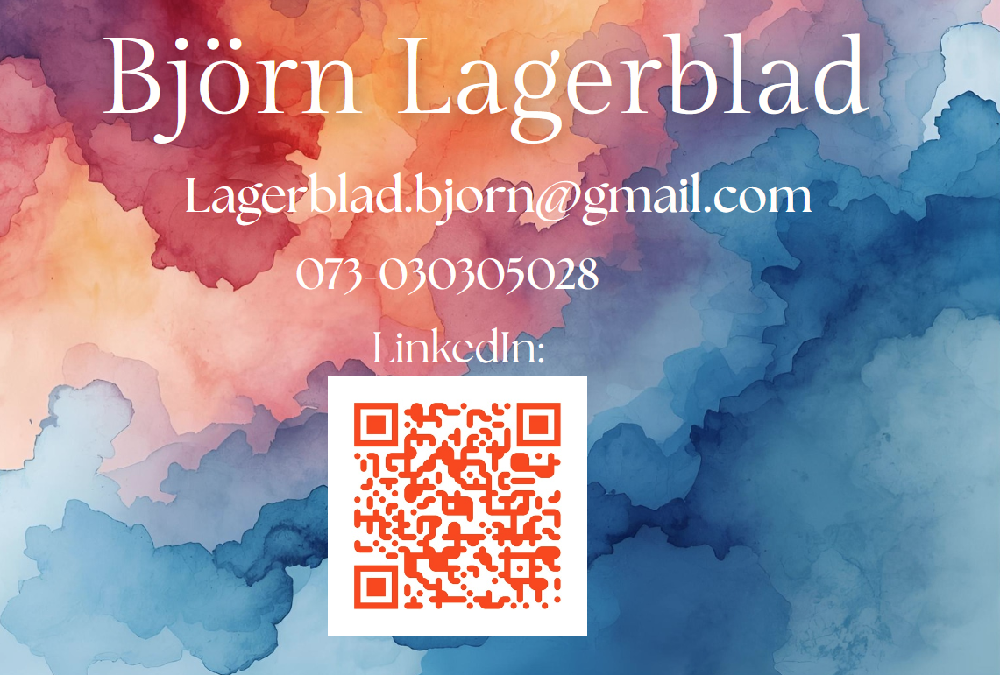

<h2 id="back-to-top">

# Hi there, I'm Björn 👋

<h2 id="contact-me">🤝 Connect with me</h2>

- [: LinkedIn][linkedin]

[linkedin]: https://www.linkedin.com/in/bjorn-lagerblad

---

* [Go to Resume](#Resume)

* [Go to Projects](#projects-wip-section)

* [Go to  Courses](#Courses)

* [Go to Contact me](#contact-me)

---
## 🧑‍💼 About me:

I’ve just wrapped up my Object-Oriented Programming studies at NBI Handelsakademin, with a focus on AI, Python, and Data Science.

Before diving into tech, I worked in customer-facing roles, which taught me how to stay calm under pressure, solve problems on the fly, and communicate clearly. Now I apply those same skills to code. Whether it’s Python, SQL, or C#, I enjoy building efficient tools and making complex problems simpler.

I’m currently open to junior roles where I can contribute, keep learning, and build real-world impact.

---
<h2 id="Resume">📓 Resume</h2>

* [Back to top](#back-to-top)

## 🧑‍💻 Technical skills:

<table>
  <tr>
    <td>Data scientist</td>
    <td>Data analyst</td>
    <td>Business intelligence</td>
  </tr>
</table>

* [Back to top](#back-to-top)

---

<h2 id="projects-wip-section">💼 Projects: OBS! UNDER CONSTRUCTION !OBS</h2>

Click on the links to view the corresponding GitHub repositories.

| Repository | Description |
| --- | --- |
| [Podcast Generator][podcast]| Full-stack project that turns Wikipedia pages, PDFs, and TXT files into radio-style podcast dialogues with back-and-forth discussion and deeper breakdowns of the content. Built with PySide6, Gemini, and multiple TTS backends. Now with background music generated depending on whats read. [Demo video on LinkedIn](https://www.linkedin.com/posts/bjorn-lagerblad_opentowork-opentowork-python-activity-7328735576239603713-BCtP?utm_source=social_share_send&utm_medium=member_desktop_web&rcm=ACoAAAw8ppQBlF2AWJEGk7GuBtXNCKCC6DNZEBo). |
| [Thesis][thesis] | Deep dive into Python automation and fullstack.  |
| [Fullstack][fullstack] | Full-stack app with Streamlit and database integration |
| [Manim][manim] | Manim animations, working with Bézier curves and design | 
|🚧 ~~[Data Science][data-science]~~ | Exploratory data analysis and machine learning projects |

[manim]: https://github.com/Markofbear/ManimTraining
[fullstack]: https://bjornyoutubedata.streamlit.app/
[pandas]: #link
[data-science]: #link
[matplotlib]: #link
[thesis]: https://github.com/Markofbear/Degree_project
[podcast]: https://github.com/Markofbear/Podcast-Generator

* [Back to top](#back-to-top)

## 🔭 Roles I'm Open To:

| **Development Roles**       | **Data Roles**               | **Specialized / Other**        |
|-----------------------------|------------------------------|--------------------------------|
| Python Developer            | Data Scientist               | AI Developer                   |
| Full Stack Developer        | Machine Learning Engineer    | Automation Engineer            |
| Backend Developer           | Data Engineer                | Data Visualization Specialist  |
| Junior Software Engineer    | Business Analyst             | DevOps Engineer                |
| C# Developer                | Quantitative Analyst         | Research Assistant (AI/NLP)    |

---
<h2 id="Courses">🎓 Courses @ NBI / Handelsakademin OOP23</h2>

<table>
    <thead>
        <th>Courses</th>
        <th>Language</th>
    </thead>
    <tr>
        <td>Introduction to Object-oriented programming</td>
        <td></td>
    </tr>
    <tr>
        <td>Object-oriented programming basics</td>
        <td></td>
    </tr>
    <tr>
        <td>Agile Project Management</td>
        <td>
            
            
        </td>
    </tr>
    <tr>
        <td>Databases</td>
        <td></td>
    </tr>
    <tr>
        <td>Artificial intelligence 1</td>
        <td></td>
    </tr>
    <tr>
        <td>Artificial intelligence 2</td>
        <td></td>
    </tr>
    <tr>
        <td>Object-oriented programming advanced 1</td>
        <td>
            
            
        </td>
    </tr>
    <tr>
        <td>Internship 1 @AIgineer</td>
        <td></td>
    </tr>
    <tr>
        <td>Object-oriented programming advanced 2</td>
        <td></td>
    </tr>
    <tr>
        <td>Thesis</td>
        <td></td>
    </tr>
    <tr>
        <td>Internship 2 @ AI Sweden</td>
        <td></td>
    </tr>
</table>

* [Back to top](#back-to-top)

---
<h2 id="contact-me">🤝 Connect with me</h2>

- [: LinkedIn][linkedin]

[linkedin]: https://www.linkedin.com/in/bjorn-lagerblad

* [Back to top](#back-to-top)